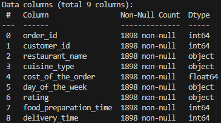

# Analisis_Food_Order
Proyek ini merupakan bagian dari pengembangan pribadi saya dalam memahami workflow analisis data. Pada proyek ini saya menggunakan bahasa pemrograman Python dengan beberapa library seperti Pandas, NumPy, Seaborn, dan Matplotlib.

## Keterangan Data
 Data [food_order.csv](food_order.csv) saya ambil dari website Kaggle pada data tersebut terdapat 9 kolom dan 1898 baris.

 Berikut adalah penjelasan untuk setiap kolom pada data ini:
 | Kolom                | Deskripsi                 |
|-----------------------|---------------------------|
| order_id              | Nomor Order               |
| customer_id           | Nomor Customer            |
| restaurant_name       | Nama Restoran             |
| cuisine_type          | Tipe Masakan              |
| cost_of_the_order	    | Biaya Pesanan             |
| day_of_the_week	    | Hari Dalam Minggu         |
| rating	            | Penilaian (1-5)           |
| food_preparation_time	| Waktu Makanan Disiapkan   |
| delivery_time         | Waktu Makanan Diantarkan  |

## Pengecekan Data
Langkah awal yang saya lakukan pada proses ini adalah melakukan pengecekan data, dimana saya melakukan pengecekan pada kolom di dataframe. Berikut kode yang digunakan:

### Cek Ringkasan
```
# Summary
df.info() 
```


Dari gambar diatas, setelah dilakukan pengecekan untuk setiap kolom pada dataframe memiliki jumlah data yang bukan null sebanyak 1898 data, dan untuk tipe datanya terbagi menjadi 3 (int, float dan object).

```
#Check null values
print(df.isnull().sum())
```
.png)

Dari gambar diatas, setelah dilakukan pengecekan tidak terdapat nilai null pada setiap kolom di dataframe.
<<<<<<< HEAD

---
=======
>>>>>>> 3a847b1f2a444ff8af86220aa1fbaced38276072

### Cek Kolom
"Kolom restaurant_name"
```
#Check restaurant name
print(df.restaurant_name.unique())
```
.png)

Dari gambar diatas, terdapat 178 Nama restoran yang berada pada kolom restaurant_name dimana beberapa dari nama restoran tersebut terdapat special character.

Hal yang saya lakukan pertama adalah memeriksa nama-nama restoran yang menggunakan special character menggunakan kode berikut:
```
#menentukan spesial karakter
def contains_special_characters(text):
    pattern= r'[¤¾Ñ¼©@#$%^*()_+{}\[\]:;<>,?~\\]'
    return bool(re.search(pattern, text))

#mengecek restoran yang menggunakan spesial karakter
weird_restaurant = df[df['restaurant_name'].apply(contains_special_characters)]
print(weird_restaurant['restaurant_name'].unique())
```
.png)

Terdapat 6 restoran yang menggunakan special character.

Selanjutnya setelah sudah menemukan restoran apa saja yang menggunakan special character, saya melakukan perubahan pada nama-nama restoran tersebut dengan kode berikut:
```
#Mengganti nama restoran lama dengan yang baru (Tanpa Special Character)
old_name = ['Big Wong Restaurant \x8c_¤¾Ñ¼','Empanada Mama (closed)',
            'Chipotle Mexican Grill $1.99 Delivery', "Joe's Shanghai \x8e_À\x8eü£¾÷´",
            'Caf̩ China', 'Dirty Bird To Go (archived)']

new_name = ['Big Wong Restaurant', 'Empanada Mama', 'Chipotle Mexican Grill', "Joe's Shanghai", 'Cafe China', 'Dirty Bird To Go']
#print(new_name)

df['restaurant_name'] = df['restaurant_name'].replace(dict(zip(old_name, new_name)))
```
Berikut hasil setelah dilakukan pergantian nama restoran
.png)

<<<<<<< HEAD
---
=======
"==================================================================================="
>>>>>>> 3a847b1f2a444ff8af86220aa1fbaced38276072

"Kolom cuisine_type"
```
df.cuisine_type.unique()
```
.png)
